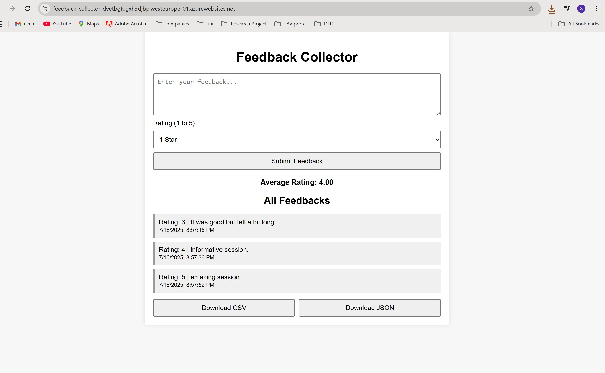

# Feedback Collector – Web App

 

# Table of Contents
- [1. Feedback Collector – Web App](#1-feedback-collector--web-app)
  - [Project Description](#project-description)
- [2. Results](#2-results)
    - [Azure Deployment](azure-deployment
    - [Screenshot](#screenshot)
    
   

# 1. Feedback Collector – Web App

## Project Description
This project is a minimal internal feedback tool for team members to **anonymously submit feedback** about meetings. Users can submit text-based feedback and a 1–5 star rating. All feedbacks are shown with timestamps.

# 2. Results

The Feedback Collector MVP fulfills all required functionalities:

-  Frontend for feedback entry and listing
-  REST API for feedback submission and retrieval
-  In-memory backend structure with extensibility
-  Azure deployment completed and accessible

## Azure Deployment

🔗 **Azure URL**: [https://feedback-collector-dvetbgf0gxh3djbp.westeurope-01.azurewebsites.net](https://feedback-collector-dvetbgf0gxh3djbp.westeurope-01.azurewebsites.net) 

## Screenshot

